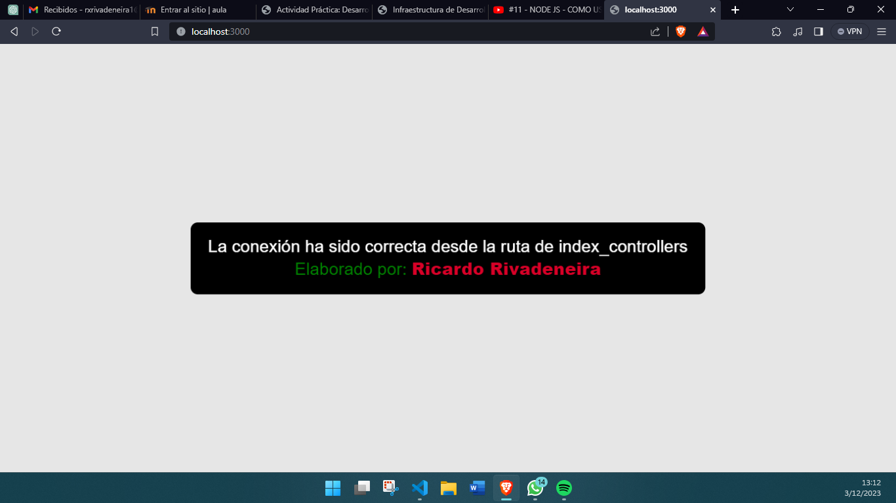
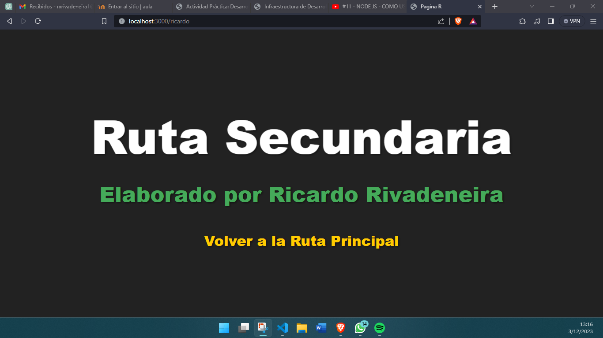
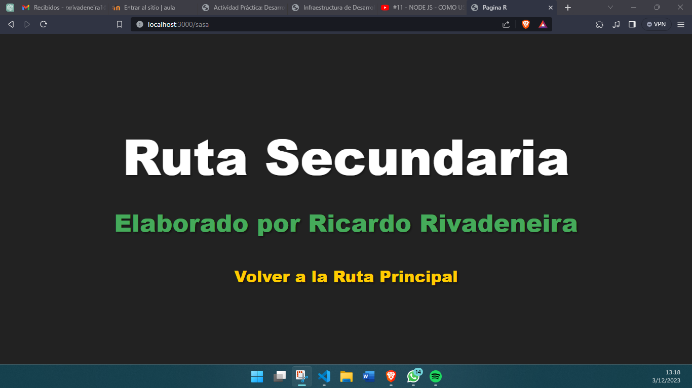

# App_NodeJs_R
## Estructura de la Aplicación

Este repositorio contiene una aplicación sencilla que utiliza Express para manejar rutas y mostrar contenido estático.

## Estructura de Carpetas

- **src**: Contiene el código fuente de la aplicación.
    - **app.js**: Este archivo es el punto de entrada principal de la aplicación. Configura Express y define las rutas principales.
    - **routes**: Carpeta que contiene archivos de rutas.
        - **index_routes.js**: Define la ruta principal '/' que utiliza un controlador desde '../controllers/index_controller'.
    - **controllers**: Carpeta que contiene archivos de controladores.
        - **index_controller.js**: Contiene la lógica para la ruta principal. Envia una respuesta con un HTML que muestra un mensaje y está diseñado con estilos CSS incrustados.
- **public**: Carpeta que contiene archivos estáticos públicos accesibles desde el servidor.
    - **index.html**: Archivo HTML principal para la ruta secundaria. Muestra un encabezado, un párrafo y un enlace.
    - **css**: Carpeta que contiene archivos de estilos.
        - **style.css**: Archivo CSS que define estilos para la página HTML.

## Despliegue y Ejecución

Para ejecutar esta aplicación, asegúrate de tener [Node.js](https://nodejs.org/) instalado en tu máquina. También necesitarás instalar la dependencia de Express.

Para instalar las dependencias, ejecuta el siguiente comando en tu terminal:

```bash
npm install express
```
## Rutas

### Ruta Principal

La **ruta principal** '/' está configurada en el archivo `src/routes/index_routes.js`. Esta ruta es la que se carga inicialmente al acceder al servidor. Al acceder a esta ruta en un navegador web, se mostrará un mensaje con un diseño específico. Se muestra un mensaje personalizado en un contenedor con estilos aplicados. Este mensaje se genera dinámicamente a través de un controlador en `src/controllers/index_controller.js`.

  <br>

### Ruta Secundaria

La **ruta secundaria** '/index.html' está configurada en el archivo `public/index.html`. Esta ruta es accesible desde la ruta principal a través de un enlace. Al acceder a esta ruta  se mostrará una página HTML simple con un encabezado, un párrafo y un enlace. La página utiliza estilos definidos en un archivo CSS ubicado en `public/css/style.css`. Este contenido estático es accesible desde la carpeta `public`.
<br>

Cabe decir, que para poder acceder a la ruta secundaria, al estar en nuestra ruta Principal, en la URL de nuestro navegador, solo debemos de colocar cualquier texto después de `localhost:3000` agregando `/*cualquiercosa*` y dar **Enter**, de esa forma se llevará a la Ruta Secundaria:
<br>

